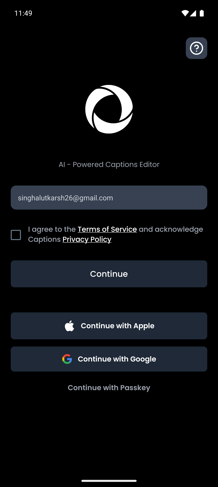
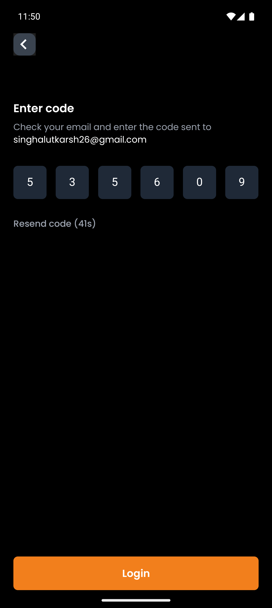
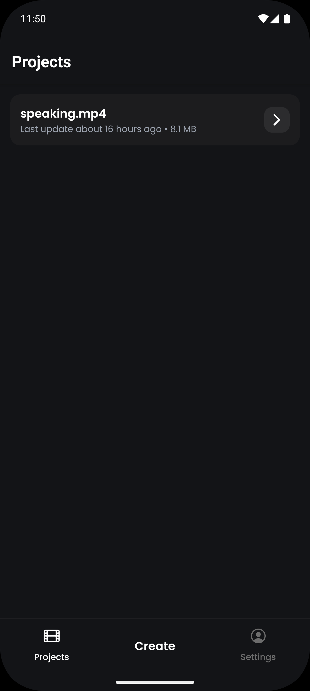
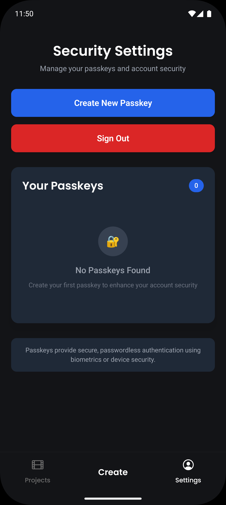
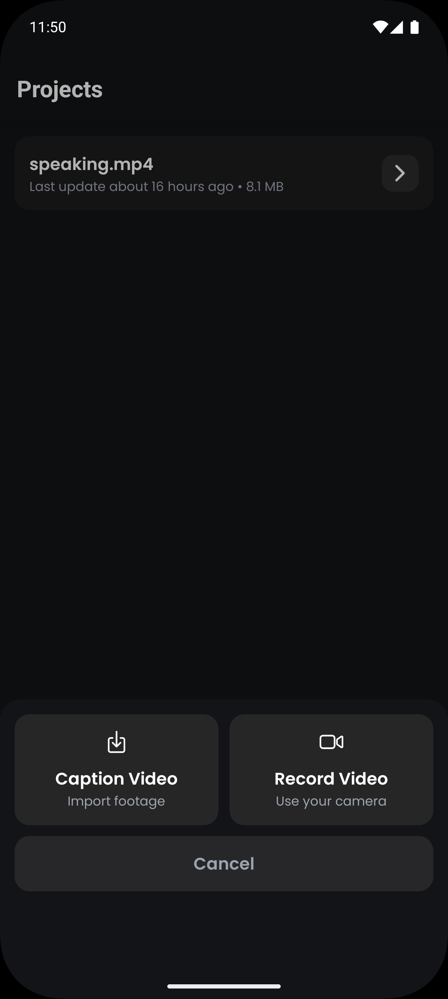
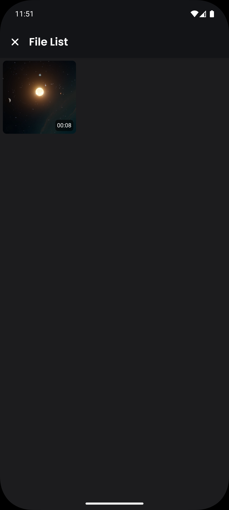
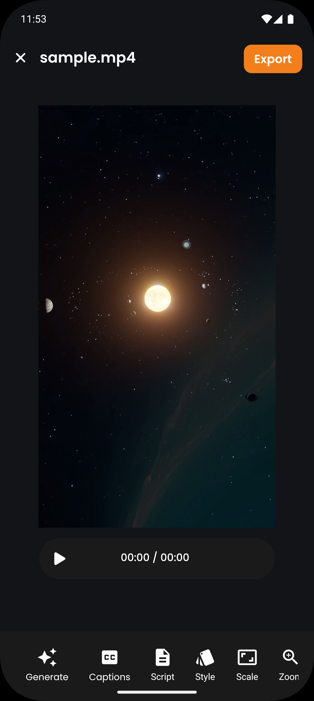

# Caption Editor

A React Native application built with Expo for editing and managing video captions.

## Screenshots

<div style="display: flex; flex-wrap: wrap; gap: 12px;">
  
  
  
  
  
  
  
  
</div>

## Tech Stack

- React Native + Expo
- TypeScript
- Convex (Backend)
- Clerk (Authentication)
- NativeWind (Styling)
- ElevenLabs (AI Voice)

## Installation

```bash
# Install dependencies
bun install

# Start development server
bun start

# Run on specific platforms
bun ios
bun android
bun web

# Prebuild
bunx expo prebuild -p android|ios
```

## Project Structure

```bash
src/
├── app/                         # Expo Router app directory
│   ├── (app)/                   # Main app routes
│   │   ├── (authenticated)/     # Protected routes
│   │   │   ├── (modal)/         # Modal screens
│   │   │   └── (tabs)/          # Tab navigation
│   │   └── (public)/            # Public routes (login, etc.)
│   ├── _layout.tsx              # Root layout
│   └── index.tsx                # Entry point
├── components/                  # Reusable UI components
│   ├── CaptionControls.tsx
│   ├── CaptionsOverlay.tsx
│   ├── VideoControls.tsx
│   └── VoiceSelectionModal.tsx
├── assets/                      # Static assets
│   ├── fonts/
│   └── images/
├── store/                       # State management
└── utils/                       # Utility functions

convex/                          # Backend functions and schema
├── auth.ts                      # Authentication logic
├── projects.ts                  # Project management
├── elevenlabs.ts                # AI voice integration
├── exportvideo.ts               # Video export functionality
└── schema.ts                    # Database schema

microservice/                    # Additional backend services
└── src/
    └── routes/
        └── transcode.ts         # Video transcoding service
```
